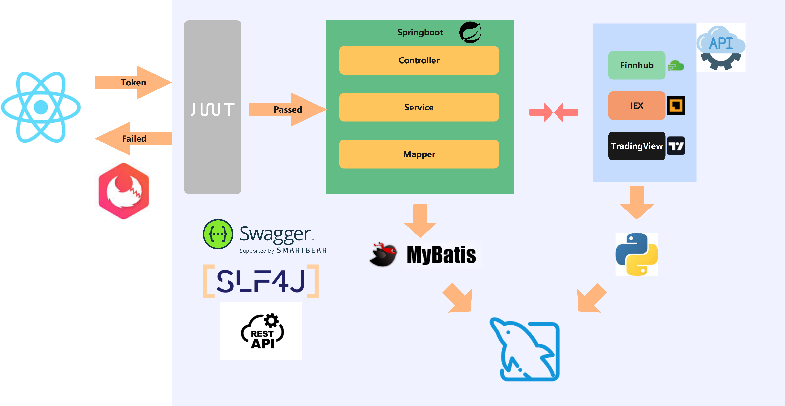
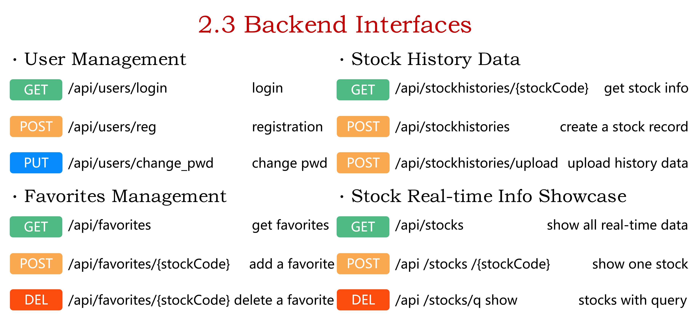
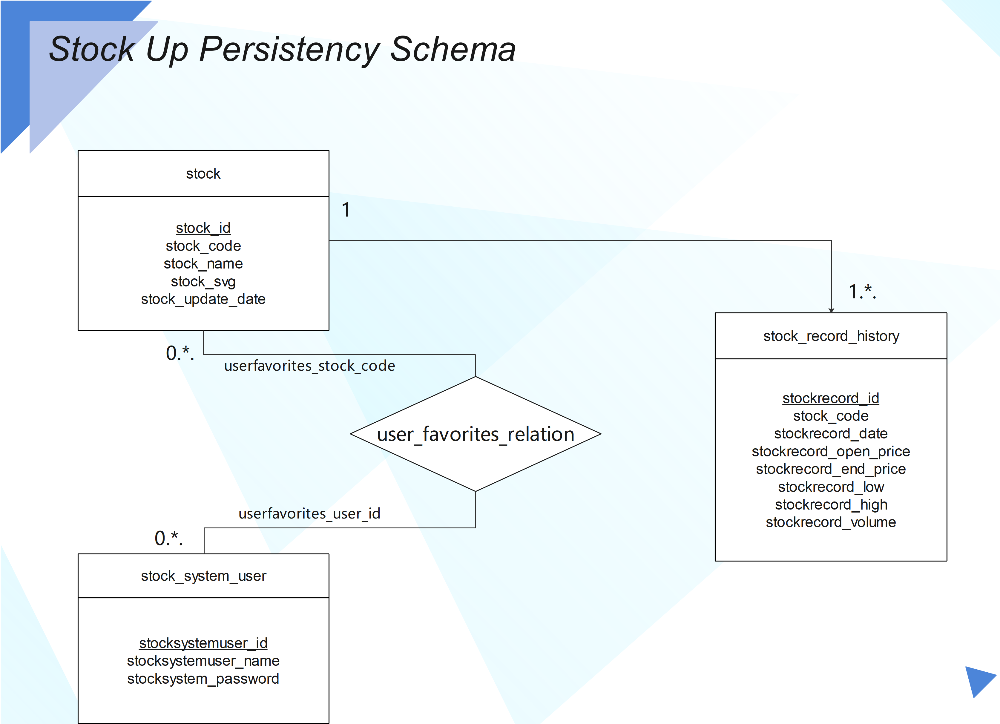

# Mockup project for Citi - a financial screening dashboard for American stocks
Author: Guangqi Jiang, Jiaxin Li @SCU (project were done during internship @ Citi Bank)

## Intorduction
This is the backend for stock dashboard project whose frontend is ...

## Framework
The picture below shows the overall framework of our backend design.

We used the following tools:
- **Java Web Token (JWT)** for user identification
- **SpringBoot** for backend development framework
- **MyBatis** for database connection
- **MySQL** for database, with Navicat for development efficiency
- **Python** for data processing
- Some **third-party APIs** for stock trade data acqusition, such as Finnhub and IEX
- **TradingView** for final prodect reference
- **Swagger** for interface documentation
- **SLF4J** for logging
- **REST API** for interface style between frontend and backend

## Quick Start
### Create the database
Using `citi.sql` to create MySQL database with your account, as well as insert all necessary data. Of course, you are welcomed to use your own data in our system. Note that this sql script was saved from Navicat, therefore it might be better for you to use Navicat, too.

### Clone this repository
Switch to your workspace, and then input the following command on your terminal:

`git clone https://github.com/Lucca-cherries/Citi_backend.git`

### Open the project directory with IDE, say IntelliJ IDEA
You might need an ultimate version of this IDE, which supports SpringBoot. If you are a student, you can get access to this version freely through their Education Plan. Before running our project, it's better for you to have some experience of running a SpringBoot project. There are tons of tutorials online which you could refer. If you encounter any problem, please raise an Issue :)

Logs will be saved at `stock.log`.

### Test with Postman or Your browser
Our interfaces, consistent with Restful style, are mainly as follows:

### Just enjoy your exploration :)

## Database Design
The picture below shows our database design.

## Other resources
Our project presentation slides and screen recording are provided. You can find more there. Detailed report is not provided for some reason. If you need it, please raise an Issue and leave your contact.